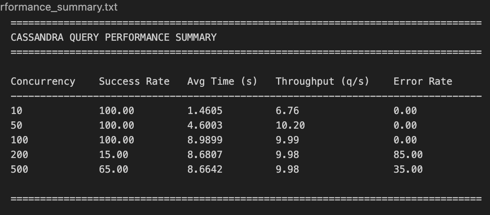
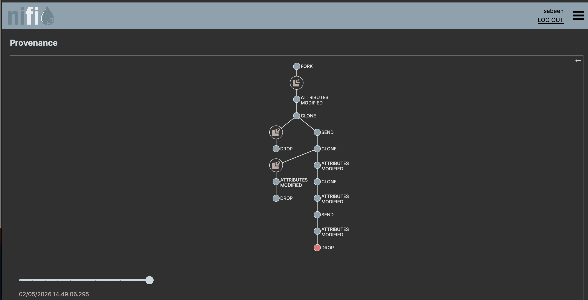
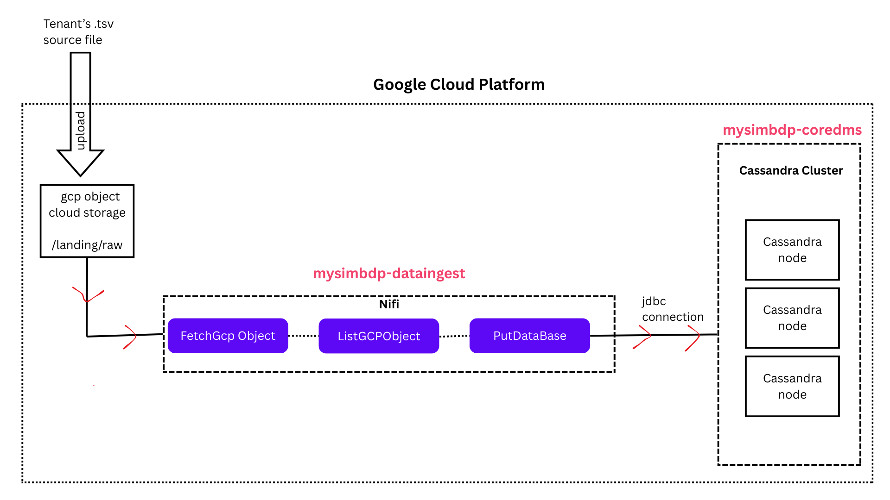
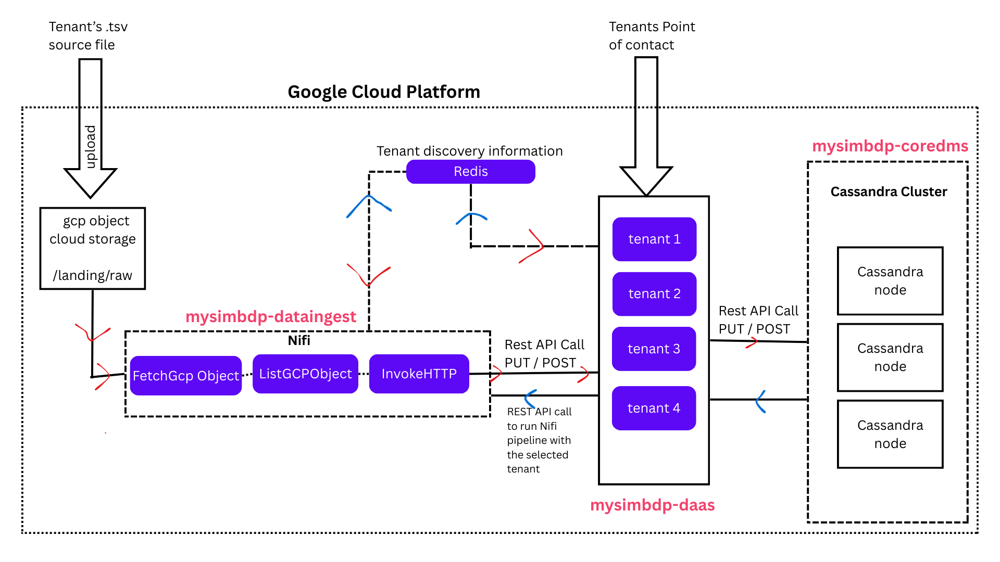

**AI Usage Disclosure**:

> I declare that I have not used AI for writing the assignment report

**Part 1 - Design** :

1. Explain your choice of the application domain, the generic types of data to be supported, and the technologies used for mysimbdp-coredms. Explain your assumption about the tenant data sources and how the data from the sources can be accessed. Explain the situations/assumptions under which your platform serves for big data workloads. (1 point)

   > I select the marketplace domain specifically 'Amazon review dataset' from kaggle (from the shared free open datasets). The reason is because marketplaces like amazon are online hence have millions of users all around the globe. these clients use such marketplaces everyday resulting in huge data generation. sellers on amazon and marketplace like amazon need up to date data for analysis to support their business.d
   > The data used is stored in the kaggle as batch files. The files are ranged from few MB files to few GB files in size. All the files have 15 columns and are in ".tsv" format which means the deliminator is tab. The data is both numeric and strings in datatype.

   > The technology used for mysimbdp-coredms is Apache Cassandra. The reason of choosing cassandar is its high availability, good scalability, and write performance. This makes it ideal for handling huge data volumes across multiple servers without a single point of failure.

   > Its assumed that the tenant has similar .tsv files with the same columns as the one's of kaggle amazon dataset.(so files can be downloaded from kaggle and used as tenant source files). In this case the tenant will use the .tsv files and upload them on the google cloud platform's google cloud object storage bucket "mysimbdp-landing-#####" in the folder "/landing/raw" (the tenant can access the cloud storage bucket and the folder after getting the IAM permissions setup).Note: for simplicity the tenant is uploading the files, later on a python or cron script or API call can we written to fetch the files from source (kaggle) and pushed on the cloud storage.

   > The assumption is that the files must follow the same structure as the .tsc file from kaggle i.e:
   >
   > - Must have the 15 columns with the eact same names.
   > - Tabs in the source files must only be used for deliminator.
   > - The characters must be utf-8 charaters.
   > - The files must be uploaded only in the landing/raw folder of the cloud bucket.
   > - The extention of the file name must me .csv or .tsv.
   > - The name of the file can be anything (as we have assumed that only such files will be uploaded by tenant for now). Note: later the dedicated folders for each tenant (with dedicate permission) can be created to uplade the files or a processor can be added in mysimpdb-dataingest to handle certain file names only.

2. Design and explain the interactions among main platform components in your architecture of mysimbdp. Explain how the data from the sources will be ingested into the platform. Explain the third parties (services/infrastructures) that you do not develop for your platform. (1 point)

   > - As mentioned for mysimpdb-core Apache cassandra is used with default setup 3 nodes binded into a cluster.
   > - For mysimpdp-dataingest Apache Nifi is used.
   > - For the hosting datacenter Google Cloud Platform is used.
   > - The source file landing point is google cloud object storoage
   > - Terraform is used for the ease of provisioning the needed architecture on GCP.
   > - using terraform, I have setup up three VM in gcp with ubuntu and have used docker to run image of the Cassandra in all three VMs and have binded them into a cluster. by running metastart script. This is all done by terraform.
   > - The Nifi is also setup on a separate VM with ubuntu.
   > - VPC network is created (with terraform on GCP) which connects the GCP cloud object storage to Nifi and then Nifi to the cassandra cluster and gives external IPs to Nifi and Cassandra Nodes.
   > - IAM settings on GCP are set accordingly
   >   Note: the cassandra nodes are externally accessible for tenants usage to integrate with other tools like BI tools. and to use cqlsh to query on the nodes.However better security can easily be implemented by having defined Ip that can access with ssh and port 9042, this can be implement in the terraform script where network permissiona are granted or done manually on gcp.

   > General data ingestion processure:
   > The Tenant will login the GCP and upload the files (as per the format and assumptions) on the "mysimbdp-landing-#####" bucket in the folder "/landing/raw". The Nifi running will check if there is any object in the raw folder, hence fetch the file and Nifi will then split the file into small batches then do basic check of format then pass to the 'Putdatabase' process in Nifi. It will connect to the cassandra node and push the small batch file into the amazon.reviews_by_product table in amazon keyspace. After successfully inserting the files it will move the successful small batch files to the /landing/processed folder in the GCP object storage. if the putdatabase encounters any issue then it will insert the corrupt small batch files into the/landing/failed cloud folder.

   > Note:
   >
   > - only the batch with error will be moved to the /landing/failed folder, the whole pipeline will not be effected.
   > - The pipeline breaks the main source file into the small batches, hence the whole batch will fail if there is even a single row issue in the file.Note: this can be further improve by having more splitrecords.
   > - Before running the pipeline, tables with keyspaces and replicaition must be present.It can be created using the script already prepared.(please follow the "Assignment-1-Delployment.md" to setup the Pipeline correctly)

3. Explain a conguration of a set of data nodes for mysimbdp-coredms so that you prevent a single-point-of-failure problem for mysimbdp-coredms for your tenants. (1 point)

   > - Have deployed 3 cassandra nodes (can be increased and decreased as per needs) to have redundancy and avoid single point fo failure.
   > - Have setup all (3 by default) the cassadnra nodes as seeds and made a cluster to make sure data can still be ingested and retreved even if 2 nodes fails.
   > - Have replication factor 3 for the keyspace 'amazon' so that the data is present in three place all the time.
   > - The cassnadra nodes are scalable as new node can be simply included in the plaform just by the terraform script changing.
   > - Have defined Cassandra nodes in mutple zones to avoid a single zone level failure.

   > Note: Have defined static internal IP's for each cassandra note for easy of setup and debugging in case of IP failure

4. You decide a pre-defined level of data replication for your tenants/customers. Explain the required number of data nodes in the deployment of mysimbdp-coredms for your choice so that mysimbdp-coredms can work properly according to the choice of replication. (1 point)

   > By default 3 cassandra nodes are setup and the keyspaces replication strategy is 'NetworkTopologyStrategy' with 'replication_factor' of 3 , hence as all 3 nodes are a cluster and the keyspace required mininmum 3 replications so all the 3 nodes will have the same data at all time. Hence if even 2 nodes fail and only one node is running, there would be no issue as all the data would be accessible.

   > Note: there might be some effect on performance.

5. Consider the data center hosting your platform, the locations of tenant data sources and the networkbetween them. Explain where you would deploy mysimbdp-dataingest to allow your tenants using mysimbdp-dataingest to push data into mysimbdp, and which assumptions you have for the deployment. Explain the performance pros and cons of the deployment place. (1 point)\

   > To deply the mysimpdb-dataingest is in the same region as the mysimbdp-core. This minimizes the latency between ingesting the data into the core. Also the datacenter cost(gcp) is low and management is easy.
   > In the case when the tenants are geographically separated and spread, it can be benefial to deploy dataingest close to the data source (the tenant) but it would introduce more latency between the datainfest and the core.
   > For my case we have assumed that the tenants are in the same region as the datacenter (GCP) which hosts the mysibpdb-dataingest and mysimpdb-core. The core nodes have been spread across multiple zones.

   > Performance Pros:
   >
   > - Low latency as the tenant is in the same regiion as the data center and the data retrevial (consumer) latency and file upload is fast.
   > - good throughput as the dataingest and core are in the same region so the network level distance between the core and the dataingest is small hence good speed of data ingestion
   > - As the core is across multiple zones this resutls in good fault tolerance and high availability.
   > - Its cost efficent solution as dataingest and core are in the same region its helps to reduce the network cost.
   > - Its highly scalable solution.

   > Performace cons:
   >
   > - limited fault tolerance, its only fault tolerant for single regions, so if there is some issue in the whole region then the whole platform will fail.
   > - can have some network congetion issues if there is some network issues in the region.

**Part 2 - Implementation**:

1. Design, implement and explain one example of the data schema/structure for a tenant whose data will be stored into mysimbdp-coredms. (1 point)

   > The file of the tenant has 15 headers and deliminator "\t" which is one tab space.
   > Have used the same names for the core table column names
   > The database or keyspace of core (cassandra) is "amazon" it has one table : "reviews_by_products" which is a flat table.
   > It has 15 columns which are as follows with their datatypes and basic descriptions
   > | Column Name | Data Type | Description |
   > | ------------| --------- | ----------- |
   > | marketplace | text | The marketplace (e.g., "US", "UK") |
   > | product_id | text | A unique identifier for the product being reviewed |
   > | review_date | date | The date when the review was written |
   > | review_id | text | A unique identifier for the review |
   > | customer_id | bigint | A unique identifier for the customer who wrote the review |
   > | product_parent | bigint | The parent product identifier for grouped products |
   > | product_title | text | The title of the product being reviewed |
   > | product_category | text | The category of the product (e.g., "electronics") |
   > | star_rating | int | The star rating given by the customer (1-5) |
   > | helpful_votes | int | The number of helpful votes received for the review |
   > | total_votes | int | The total number of votes the review has received |
   > | vine | text | Whether the review is part of Amazon's Vine program (e.g., "Y", "N") |
   > | verified_purchase | text | Whether the review is from a verified purchase ("Y" or "N") |
   > | review_headline | text | The headline or summary of the review |
   > | review_body | text | The full text of the review |

2. Given the data schema/structure of the tenant (from the previous point), design a strategy for data partitioning/sharding, explain the goal of the strategy (performance, data regulation, etc.), and explain your implementation for data partitioning/sharding together with your design for replication in Part 1, Point 4, in mysimbdp-coredms. (1 point)

   > Looking at the data schema and actually data . The partitions can be done on the basis of marketplace, product_id and review_date. This ensure that the data is grouped by products, marketpalce and the date. This can spread the data well even in same marketplace and product. as some marketplaces and some prodcuts can have high review but the date will keep the partitions equally spread.
   > cluster key can be selected reviews_id. This will help keeping the data sorted. as reviews_id are unique so the sorting willbe done properly.

   > The goal:
   >
   > - The goal is to have good query speed especially of time based queries.
   > - To have evenly distributed data even when more data is added with uneven count of reviews for different products and different marketplaces.
   > - The partitions will be maintained in each replica hence the data will be highly available and due to partitioning , with good read capabilties.

3. Assume that you play the role of the tenant, emulate the data sources with the real selected dataset and write a mysimbdp-dataingest that takes data from your selected sources and stores the data into mysimbdp-coredms. Explain the atomic data element/unit to be stored. Explain possible consistency options for writing data in your mysimdbp-dataingest. (1 point)

   > The atomic data element/unit for storing in mysimbdp-coredms is a review record.Each review consists of multiple fields that describe the review and its attributes. The detail is already shared for the columns in table Part 2 Q.1
   > The possible consistency options:
   >
   > - Cassandra has consistency option that can be selected when writing the data, here is a brief intro to few options
   >   - ANY : the write is succesfull as as soon as any replica acknowledges the write. Not very consistent but fast write.
   >   - ONE: The write is successfull when even one replica node acknowledges the write. When low latency is needed for some consistency
   >   - QUORUM: The write is successfull when more than half of the replicas acknowledge the write. Stronger consistency with good performance. (By default set in our solution)
   >   - ALL: The write is succesfull when all replicas acknowledge the write. strong consistency but high latency
   > - The data is written and eventualy transfered to all the nodes to have high availability. This is good for fast data ingestion where immediate consistency is not needed.
   > - the second option is to have strong consisteny like data is immediately consistent and spread across all the nodes right after the write. This is good for cases then real time consistency is requried but result is high latency.

   > For implementation of consistency with Nifi, the consistency rule is passed as database JDBC connection like this :jdbc:cassandra://10.0.0.10--10.0.0.11--10.0.0.12:9042/amazon?localdatacenter=datacenter1&consistency=ONE from the Nifi controller.

   > Note: help taken from https://www.geeksforgeeks.org/dbms/consistency-levels-in-cassandra/

4. Given your deployment environment, measure and show the performance (e.g., response time,throughput, and failure) of the tests for 1,5, 10, .., n of concurrent mysimbdp-dataingest writing data into mysimbdp-coredms with different speeds/velocities together with the chnge of the numbaer ofnodes of mysimbdp-coredms. Indicate any performance differences due to the choice of consistency options. (1 point)

   > I have measure the throughput and latency while writing the data from nifi to the cassandra. The test results are recorder for 1,5,10 concurrent dataingest writing into the casssandra node with 1 and 3 nodes combinations and 2 of the consistency options ALL and ONE
   > The time taken to insert the record is calculted by looking at the lineage time taken by the Nifi processor : "PutDataBase"
   > Simply by dividing the file size by time taken we get the throughput.
   > The write latency for cassandra is checked by running the "nodetool tablestats" command inside the cassandra node.
   > The no. of concurrent write is changed from the properties of the "PutDatabase" processor of Nifi.
   > {width=500}
   > The no. of nodes are change by changing the node count variable in the terraform script.
   > The type of consistency is changed by changing the database connection URL from the JDBC controller URL
   > {width=500}
   > The following table shows the comparison of throughput and latency with different setups of data producer
   > {width=500}

   > Observations:

   > Consistency Level Impact:
   >
   > - ALL Consistency:
   >   Leads to higher ingestion times, lower throughput, and higher latency compared to ONE consistency.
   >   - Requires acknowledgment from all replica nodes, which introduces more overhead.
   > - ONE Consistency:
   >   Faster writes and lower latency compared to ALL.
   >   - Requires acknowledgment from only one replica, resulting in faster write operations and better performance.

   > Effect of Increasing Concurrent Writes:
   >
   > - Increasing the number of concurrent writes (from 1 to 10) significantly improves throughput and reduces ingestion time for both consistency settings (ALL and ONE).

   > Effect of Number of Cassandra Nodes:
   >
   > - More nodes (3 nodes vs. 1 node) leads to better performance
   > - Faster ingestion time due to the distributed workload.
   > - Higher throughput as data is parallelized across multiple nodes.
   > - Lower latency when using more nodes, although the difference is very small.
   > - Single node setups result in higher ingestion times and lower throughput.

   > Ingestion Time vs. Throughput:
   >
   > - As the number of concurrent writes increases, the throughput improves, and the ingestion time decreases.
   > - Throughput increases linearly with more concurrent writes (e.g., from 1 to 10), showing the effectiveness of parallel data writes.

   > Latency and Throughput Trade-off:
   >
   > - ALL consistency has higher latency but provides stronger consistency guarantees.
   > - ONE consistency results in lower latency and higher throughput.

   > Conclusion:
   > ONE consistency provides better performance in terms of speed but with weaker consistency.
   > The number of Cassandra nodes directly impacts performance, with more nodes leading to better throughput.
   > Throughput improves significantly as concurrency increases.

   > Note: Few extra observations when doing testing
   > Error observed "batch size too large" as no. of concurrent writters increased.
   > Error is obseved with 1 node and 3 replication with consistency ALL. As there is only 1 node so cant have 3 replicas. No error encountered when 1 node and 2 replicas and consistency set to ANY. As for write even 1 node is enough for sucessfull write.
   > {width=500}

5. Write a data consumer by querying/retrieving data in mysimbdp-coredms. Observe and present the performance and failure problems when you increase the number of concurrent data producers and consumers and their ingested data and queries. Propose the change of your deployment to avoid such problems (or explain why you do not have any problem with your deployment). (1 point)

   > Have created a ConsumerTest.py that test the read with multiple read request and creates a summary report for analysis (performance_summary.txt)
   > The test is done with 3 nodes, replication factor 3 and 100 queries are tested with 10,50,100,200,500 concurrent connections
   > Here is a summary table {width=500}
   > Observations:
   >
   > - Timeout failure is observed at high concurrenct reads >= 200 and 500
   > - Reponse time increased linearly as the concurrect reads increaes
   > - Throughput becomes fixed at 10 query / sec at 100 queries and remain same.
   > - Time out issue is only returned for one node
   >   Note: for testing we are doing full table query to test full stress

   > Solution:
   >
   > - Have load balancing to manage the incomming traffic better to not stress one node
   > - Have more powerfull cassandra nodes with better resources and memmory
   > - Have more cassandra nodes
   > - If needed we can increase the cassandra nodes with cloud autoscaling feather to dynamically increase and decrease the nodes with traffic.
   > - Can have a cache layer to avoid hitting the database again and again if the same query is triggered.

**Part 3 Extension**:

1. Using your mysimbdp-coredms, a single tenant can run mysimbdp-dataingest to create many different databases/datasets. The tenant would like to record basic lineage of the ingested data.Explain the types of metadata about data lineage you would like to support. Provide one example of lineage data. Explain from where and how you can have such lineage data. (1 point)

> Nifi provides some basic data lineage feature. Given data lineage between it processors.The lineage shown is about the data fetched from gcp , splitted into batches then data send to cassandra then files moved in the gcp cloud. Its does not shows the lineage between the cassandra tables, as Nifi or mysimpdb-dataingest is jsut used as ETL tool.If tenant want to have such data lineage then this feature of Nifi can be used.
> {width=500}

> If data lineage between cassadnra table is required. then we can enable cdc feature of cassandra to record the changes and then intergate it with (apache kafka or dbt) to have the changes recorded in a dedicate lineage table created in Cassandra.
> But for future implementations a dedicate registory can be set to record the changes into a json type format table to have data lineage information of Nifi and cassandra and then this can be intergated with any monitoring tool to observe the lineage.

> The metadata can be of json format and have following type
>
> - Source: Where the data originates (external, cassandra which table or keyspace),.
> - Transformation Details (if any): any transformation applied to the data (cleaning, aggregation).
> - Destination: Where the data is finally stored (e.g., which Cassandra node,cassandra table, cassandra keyspace).
> - Timestamp: When the data was ingested or transformed.
> - Operation Type: The type of action performed on the data (insert, update, delete).

> Example: \
> Source: Cassandra bronze table
> Transformation: Data was cleaned (removed empty records)
> Destination: Cassandra silver table
> Timestamp: 2026-02-05 10:00:00
> Operation: UPSERT

> Example: The data is moved from bronze table to silver table -> cdc records the changes -> the changes are stored in the lineage table with the metadata mentioned above -> data lineage tool used to observe

2. Assume that each of your tenants/users will need a dedicated mysimbdp-coredms. Design the data schema of service and data discovery information for mysimbdp-coredms that can be published into an existing registry (like Redis, ZooKeeper, consul or etcd) so that you can find information about which mysimbdp-coredms is for which tenants/users. (1 point)

   > Firstly let assume that we already have a registory like Redis to store the information.
   > We can design a schema in the Redis registory where there is tenanr ID as the key and the value is a structed as a json object containing the metadata like
   >
   > - mysimbdp_coredms_instance: Unique identifier for the mysimbdp-coredms instance assigned to the tenant.
   > - service_endpoint: URL or address where the tenant can access their mysimbdp-coredms instance.
   > - status: The current status of the instance (active, inactive).
   > - region: The physical region or availability zone where the instance is hosted.

   > This can be then published to the registory Rwdis so that we can keep record of which mysimpdb-core node belongs to which tenant
   > We can setup as API call to the Redis to fetch this information about the tenant and its dedicate node.

3. Explain how you would change the implementation of mysimbdp-dataingest (in Part 2) to integrate aservice and data discovery feature (no implementation is required). (1 point)

   > So first we need to make sure that the Redis registory is up and running and has core Node information(mentioned the Q2) .Now in the dataingest(Nifi) we need to create a controller InvokeHTTP to send API request to Redis and fetch the dedicate Core node information for the logged in user. This information from the Redis API can be then passed as variable to PutDatabase and other processors to ingest the data only in the dedicated node of the user.

4. Assumethat you have to introduce a new key component, called mysimbdp-daas, of which APIs can be called by external data producers/consumers to store/read data into/from mysimbdp-coredms.Tenants can get shared or dedicated instances of mysimbdp-daas for their usage. Assume that only mysimbdp-daas can read and write data into mysimbdp-coredms. Explain how you would change your mysimbdp-dataingest (in Part 2) to work with mysimbdp-daas. Draw the updated architecture of your mysimbdp. (1 point)

   > The new component will act as a middleware between all incoming and outgoing information
   > It must be connected to Redis for Dedidcated node services for tenant
   > Moreover mysimbdp-daas can be used as the only point of contact for the tenant, from where tenant will run nifi and push records in the core.
   > Due to the new component now the data ingest (Nifi) would not use putdatbase processor with JDBC connection to insert data into the core. Now dataingest (Nifi ) would use processor like InvokeHTTP and pass the batch data as Rest API calls to the mysimpdb-daas. Then mysimpdb-daas would have the API call setup for cassandra and send the data into the cassandra nodes.

   > Nifi has Rest API feature that can be used to start and stop the Nifi pipelines upon receiving the request from the daas.
   > Current architecture
   > {width=500}

   > The new proposed architecture with mysimpdb-daas
   > {width=500}

   > Note: This mysimpdb-daas can be used for consumer as well. By this we can make the Core not accessible by external IP and be more secured.

5. Assume that the platform allows the tenant to define which types of data should be stored in a hot space and which in a cold space in the mysimbdp-coredms. Provide one example of constraints based on characteristics of data for data in a hot space vs in a cold space. Explain how you would support automaatically moving data from a hot space to a cold space. Explain also possible inconsistencies that may happen when accessing hot and cold data. (1 point)

> Based of data retrieval frequency we can have hot space dedicate for hot data. We can use cassandra 'nodetool tablestats' and 'nodetool toppartitions' to check the most retrieved table nd top retrieved. partition and move them to hot space.Similarly, move the cold table and cold partitions to cold space.

> Another constraint can be time based.The latest data to certain time like 1 year can be in hot space and older data can be in the cold space. So newly ingested data has high chances of retrieval so its can be in the hotspace.

> We can create a TTL policy in cassandra, for example

INSERT INTO hot_data_table (id, data, timestamp) VALUES (uuid(), 'data', toTimestamp(now())) USING TTL 2592000;

> 30 days will remain in hot space, 2592000 sec = 30 days

> Moveover a cron job can written to run periodically to move less accessed data(by using nodetool tablestats and nodetool toppartitons) to move the cold data to cold tables and move more access data to hot tables.

> The possible inconsistency can be:
>
> - When there is need to access both tables hot and cold, then latency would become high due to call to cold table.
> - Let say if the cold table is stored is cheap and different system then it might not be immediatly available, so we can have unavailability issues.
