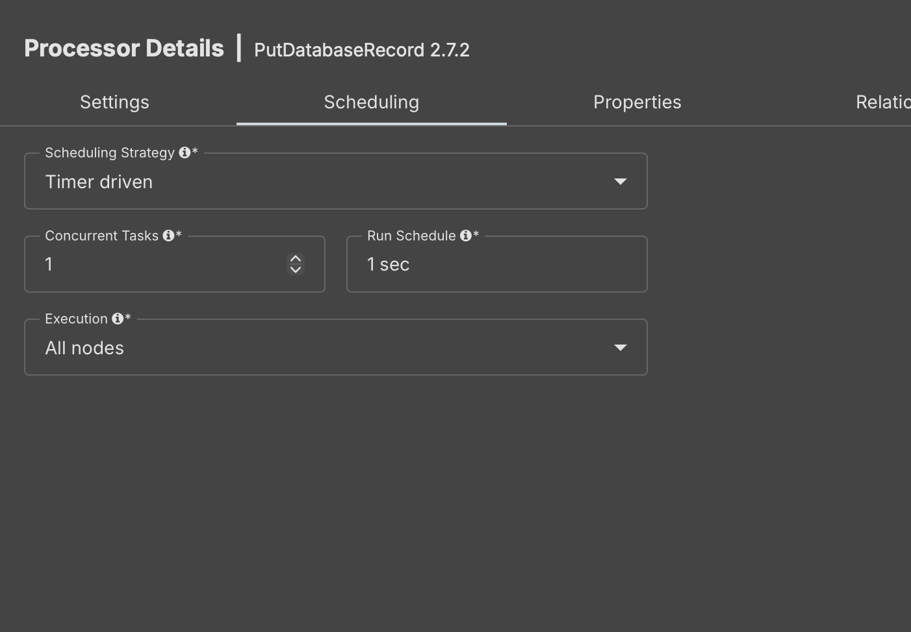
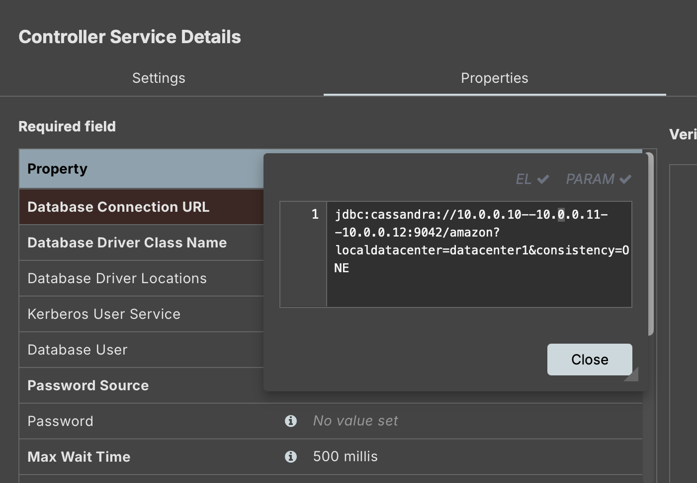
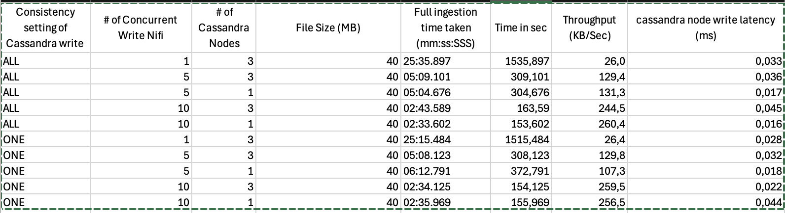
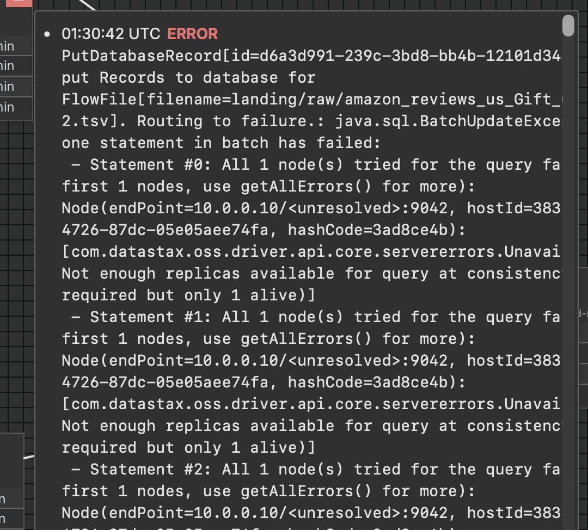

**AI Usage Disclosure**:

> I declare that I have not used AI for writing the assignment report

**Part 1 - Design** :

1. Explain your choice of the application domain, the generic types of data to be supported, and the technologies used for mysimbdp-coredms. Explain your assumption about the tenant data sources and how the data from the sources can be accessed. Explain the situations/assumptions under which your platform serves for big data workloads. (1 point)

   > I select marketplace amazon review dataset from kaggle (from the shared free open datasets). The reason is because marketplaces like amazon are online based hence have have millions of clients all around the globe, using such marketplaces everyday, hence this results in huge data being generated.

   > The data used is stored in the kaggle as batch files. the files ranged from few MB files to few GB files. All the files have 15 columns and are in ".tsv" format which means the deliminater is tab. The data is both , numberic and strings.

   > The technoligy used for mysimbdp-coredms is Apache Cassandra. The reason of choosing cassadar is it high availability, massive scalability, and good write performance, making it ideal for handling huge data volumes across multiple servers without a single point of failure.

   > Its assumed that the tenantn has similar .tsv files with the same columns as the one's of kaggle amazon dataset.(so i am downloading the files from kaggle as tenant soruce files). In this case the tenant will use the .tsv files and upload them on the google cloud platform's google cloud object storage bucket "mysimbdp-landing-#####" in the folder "/landing/raw" (the tenant can access the cloud storage bucket and the folder after getting the IAM permissions setup).

   > The assumption is that the files must follow the same structure as the .tsc file from kaggle i.e:
   >
   > - Must have the 15 columns with the eact same names.
   > - Tabs in the soruce files must only be used for deliminator.
   > - The characters must be utf-8 charaters.
   > - The files must be uploaded only in the landing/raw folder of the cloud bucket.
   > - The extention of the file name must me .csv or .tsv.
   > - The name of the file can be anything (as we have assumed that only such files will be uploaded by tenant)

2. Design and explain the interactions among main platform components in your architecture ofmysimbdp. Explain how the data from the sources will be ingested into the platform. Explain thethirdparties (services/infrastructures) that you do not develop for your platform. (1 point)

   > - As mentioned for mysimpbdp-core Apache cassandra is used with default setup 3 nodes binded into a cluster.
   > - For mysimpbdp-dataingest Apache Nifi is used.
   > - For the platform Google Cloud Platform is used.
   > - As the landing point for my product , google cloud object storoage is used.
   > - Terraform is used for the easie of provisions architurecute on GCP.
   > - I have setup up three VM in gcp with ubunte and have used docker to run image of the Cassandra in all three VMs and have binded them into a cluster. by running metastart script. This is all done by terraform.
   > - The Nifi is also setup on a separate VM with ubuntu.
   > - VPC netowrk is created (with terraform on GCP) with connects the GCP cloud object storage to Nifi and then Nifi to the cassandra cluster and gives external IPs to Nifi and Cassandra Nodes.
   > - IAM settings on GCP are set accordingly
   >   Note: the cassandra nodes are externally accessible for tenants usage to integrate with other tools like BI tools. and to use cqlsh to query on the nodes.However better security can easily be implemented by having defined Ip that can access with ssh and port 9042, this can be implement in the terraform script where network permissiona re granted.

   > The Tenant will login the GCP and upload the files (as per the format and assumptions) on the "mysimbdp-landing-#####" bucker in the folder "/landing/raw". The Nifi running will looks for if there is any object in the raw folder, hence fetch the file and Nifi will then split the file into small batches then do basic check of format then pass to the Putdatabase process in Nifi. it will connect to the cassandra node and push the small batch file into the amazon.reviews_by_product table in amazon keyspace.after successfully inserting the files it will move the succes small batch file to the /landing/processed folder in the GCP object storage.And it the putdatabase encontered any issue will inseritng intot he cassadnra table it twill then not insert into the tabl but move the file to /ladning/failed.

   > Note:
   >
   > - similarly if will slitping and checking is there any issue in the small batch then it fill be push to the /landing/failed.
   > - only the rows with error will be moved to the /lanfinf/failed folder, the whole pipelien of file will nnote me rolledback.
   > - here the pipeline break the main souce file into the batched hence the whole batch will fail if there is a single row issue in the file.
   > - Before running the pipeline, tables with keypaces and replcaition must be presetna dn can be created using the script already prepared.(please follow the "Assignment-1-Delployment.md" to setup the table correctly)

3. Explain a conguration of a set of data nodes for mysimbdp-coredms so that you prevent a single-point-of-failure problem for mysimbdp-coredms for your tenants. (1 point)

   > - Have deployed 3 cassandra nodes (can be increased and decreased as per needs) to have redundancy and avoid single point fo failure.
   > - Have setup all (3 by default) the cassadnra nodes as seeds and make a cluster to make sure that they can docsuer eachother if one node fails
   > - Have defined static internal IP's for each cassandra note for easy of setup and debugging in case of IP failure
   > - The cassnadra nodes are scalable as new node can be simply included in the plaform just by the terraform script changign.

   > - Have defined Cassandra nodes in mutple zones to avaid a signle zoen level failure.

4. You decide a pre-defined level of data replication for your tenants/customers. Explain the required number of data nodes in the deployment of mysimbdp-coredms for your choice so that mysimbdp-coredms can work properly according to the choice of replication. (1 point)

   > By default 3 cassandra nodes are setup and the keyspaces ahs strategy 'NetworkTopologyStrategy' with 'replication_factor' of 3 , hence as all 3 nodes are a cluster and the keyspace required mininmum 3 replications so all the 3 nodes will have the same data at all time. Hence if even 2 nodes fail and only one node is running, there would be no issue as all the data would be accessible.

5. Consider the data center hosting your platform, the locations of tenant data sources and the networkbetween them. Explain where you would deploy mysimbdp-dataingest to allow your tenants using mysimbdp-dataingest to push data into mysimbdp, and which assumptions you have for the deployment. Explain the performance pros and cons of the deployment place. (1 point)\

   > to deply the mysimbdp-dataingest is the same region as the mysimbdp-core would minimize the latenct between ingesting the data into the core and also the cost and management requreid woudl be low.
   > int he case when the tenants are geographically speareted so it can be benefial to deploy dataingest close the the data soruce (the tenant) but it woudl introcute latency between the datainfest and the core,
   > For my case we have assuemd that the tenants are int eh same region as the datacenter (GCP) haivng the Dataingest and Core , yes the core have been spread across mutile zoens to avodu failuer.
   >
   > Performance Pros:
   >
   > - Low latency as the tenatna re int he same regiion as the data center and teh dat atrancer latency in very low so fast ingestions.
   > - good throughput as the dataingest and core are the the same region so the ditranst betweent he core adn datainest is small hence good speed of data infestion.
   > - as core is accors muoile zoens for have good fault toleracne and avaialbleity
   > - its cost efficent as datainfest ans core are int he sae m region its heklp to regude the fata trander cost and opretaional cost
   > - its scaleable easily

   > Performace cons:
   >
   > - limieted reducnact , its only faitl tolerant for adingle regions , so if ther is some issue int he while resion then the whole platforms fail.
   > - can have some netowkr congesttio issues if ther eis somenetowrk issue int he region.

**Part 2 - Implementation**:

1. Design, implement and explain one example of the data schema/structure for a tenant whose data will be stored into mysimbdp-coredms. (1 point)

   > The file of the tenant has 15 headers and deliminator "\t" which is one tab space.
   > So hav eused the same names for the core table column names
   > The database of the keyspace of core (cassandra) is "amazon" it has one table : "reviews_by_products" which is a flat table.
   > it has 15 columns which as as follows with there datatypes
   > | Column Name | Data Type | Description |
   > | ------------| --------- | ----------- |
   > | marketplace | text | The marketplace (e.g., "US", "UK") |
   > | product_id | text | A unique identifier for the product being reviewed |
   > | review_date | date | The date when the review was written |
   > | review_id | text | A unique identifier for the review |
   > | customer_id | bigint | A unique identifier for the customer who wrote the review |
   > | product_parent | bigint | The parent product identifier for grouped products |
   > | product_title | text | The title of the product being reviewed |
   > | product_category | text | The category of the product (e.g., "electronics") |
   > | star_rating | int | The star rating given by the customer (1-5) |
   > | helpful_votes | int | The number of helpful votes received for the review |
   > | total_votes | int | The total number of votes the review has received |
   > | vine | text | Whether the review is part of Amazon's Vine program (e.g., "Y", "N") |
   > | verified_purchase | text | Whether the review is from a verified purchase ("Y" or "N") |
   > | review_headline | text | The headline or summary of the review |
   > | review_body | text | The full text of the review |

2. Given the data schema/structure of the tenant (from the previous point), design a strategy for data partitioning/sharding, explain the goal of the strategy (performance, data regulation, etc.), and explain your implementation for data partitioning/sharding together with your design for replication in Part 1, Point 4, in mysimbdp-coredms. (1 point)

   > Looking at the data have partioned the data on the basis of marketplace, product_id and review_date. This ensure that the review data is grouped by prdocuts , marketpalce and the date the prict is reviews hence making good and equal partions.
   > cluester key selected is reviews \_id this will help keeping sorting the reiviews in the pation and give unuqieeness and efficenrt access.
   > The goal:
   >
   > - is to have good query speed especially of time based querIes.
   > - to have evenly distruted data even when more data is added with uneven counT of review for diffrent products from differnt no of review for diffrent regions.
   > - as we have 3 replifcation factor so have replication when node fails. for have high availablilty and faitl tolerance . have NetworkTopologyStrategy sot he dat is distribted across mutile zones for better avaiablility adn discaster revocery.

3. Assume that you play the role of the tenant, emulate the data sources with the real selected dataset and write a mysimbdp-dataingest that takes data from your selected sources and stores the data into mysimbdp-coredms. Explain the atomic data element/unit to be stored. Explain possible consistency options for writing data in your mysimdbp-dataingest. (1 point)

   > The atomic data element/unit for storing in mysimbdp-coredms is a review record.Each review consists of multiple fields that describe the review and its attributes. The detail is already shared for the columns in table Part 2 Q.1
   > The possible consistency options:
   >
   > - the data is written and eventaully transtered to all the nodes to have high availability. This si good for fast data infestion where immedicate consistency is not needed.
   > - the secodn option is to have strong consisteny like data is immedaitlty consisent and spreac across all the nodes right after the write. this is goos for cases then real time consiten is requried but result in highed latency and overhead.
   > - Now the third option is allowing the configuration of consistency level for each write, Cassadnra give this option as ONE,QUORUM and ALL . this proces the helps to achieve flexibilt between performace and consisteny. some options are
   >   - ANY : the write is succesfullas as soon as any replica acknowledges the write.Not very consistent but fast write.
   >   - ONE: the write is succesfull when one replica node acknoledges the write. When low latency is needed for some consistency
   >   - QUORUM: the write is successfull when morethan half of the replicas acknoeldge the write. stronger consistency with good performance.
   >   - ALL: the write is succesfull whenn all replicas acknoledge the write. strong consistency but high latency
   >     Note: help taken from https://www.geeksforgeeks.org/dbms/consistency-levels-in-cassandra/
   >     For implementation of consistency with Nifi, the consistency rule is passed as database connection rule like this :jdbc:cassandra://10.0.0.10--10.0.0.11--10.0.0.12:9042/amazon?localdatacenter=datacenter1&consistency=ONE

4. Given your deployment environment, measure and show the performance (e.g., response time,throughput, and failure) of the tests for 1,5, 10, .., n of concurrent mysimbdp-dataingest writing data into mysimbdp-coredms with different speeds/velocities together with the chnge of the numbaer ofnodes of mysimbdp-coredms. Indicate any performance differences due to the choice of consistency options. (1 point)

   > I have measure the throughput and latency while writing the data from nifi to the cassandra. The test results are recorder for 1,5,10 concurrent dataingest wirtingn into the casssandra node with 1 and 3 nodes combinations and 2 of the consistency options.
   > The time taken to insert the record is calculted by looking at the linage time taken by the Nifi processor : "PutDataBase"
   > simply by dividing the file size by time taken we get the throughput.
   > the write latency for cassandra is checked by running the "nodetool tablestats" command inside the cassandra node.
   > The no. of concurrent write is changed from the properties of the "PutDatabase" processor of Nifi.
   > {width=500}
   > The no. of nodes are change by cahnging the ndoe count variable int he terraform script.
   > The type of consistency is changed by changing the database connection URL from the connection controller.
   > {width=500}
   > The following table shows the comparison of throughput and latency with different setups.
   > {width=500}
   > CONCLUSION:
   > Consistency Level Impact:
   > ALL Consistency:
   > Leads to higher ingestion times, lower throughput, and higher latency compared to ONE consistency.
   > Requires acknowledgment from all replica nodes, which introduces more overhead.
   > ONE Consistency:
   > Faster writes and lower latency compared to ALL.
   > Requires acknowledgment from only one replica, resulting in faster write operations and better performance.
   > Effect of Increasing Concurrent Writes:
   > Increasing the number of concurrent writes (e.g., from 1 to 10) significantly improves throughput and reduces ingestion time for both consistency settings (ALL and ONE).
   > Higher concurrency increases throughput but may also slightly increase latency, especially with ALL consistency.
   > Effect of Number of Cassandra Nodes:
   > More nodes (3 nodes vs. 1 node) lead to better performance:
   > Faster ingestion time due to the distributed workload.
   > Higher throughput as data is parallelized across multiple nodes.
   > Lower latency when using more nodes, although the difference is relatively small.
   > Single node setups result in higher ingestion times and lower throughput.
   > Ingestion Time vs. Throughput:
   > As the number of concurrent writes increases, the throughput improves, and the ingestion time decreases.
   > Throughput increases linearly with more concurrent writes (e.g., from 1 to 10), showing the effectiveness of parallelizing data writes.
   > Latency and Throughput Trade-off:
   > ALL consistency has higher latency but provides stronger consistency guarantees.
   > ONE consistency results in lower latency and higher throughput.
   > Increasing concurrency causes slightly higher latency in some cases, particularly with ALL consistency.
   > Performance Benchmarking:
   > For each Cassandra node configuration, increasing concurrency improved the throughput and reduced the ingestion time significantly, suggesting that parallelizing the writes in NiFi is beneficial for performance.
   > Three-node setup significantly reduces the time taken for the ingestion process, especially when concurrency is high.
   > Key Takeaways:
   > NiFi’s concurrency setting plays a significant role in improving performance.
   > ONE consistency provides better performance in terms of speed but with potentially weaker consistency.
   > The number of Cassandra nodes directly impacts performance, with more nodes leading to better throughput and lower latency.
   > Throughput improves significantly as concurrency increases, but latency may increase slightly, especially when using ALL consistency.

   > failure : "batch size too large" is observed with more concurrent writters
   > error is obseved with 1 node 3 replication with consistency ALL when writting at 3 replica are not there but no error encountered when 1 node 2 replicas and cosnsitency ANY
   > {width=500}

5. Write a data consumer by querying/retrieving data in mysimbdp-coredms. Observe and present the performance and failure problems when you increase the number of concurrent data producers and consumers and their ingested data and queries. Propose the change of your deployment to avoid such problems (or explain why you do not have any problem with your deployment). (1 point)
   > have created a consumer.py that test the read with multiple read request
   > have encountered failure to featch due to high read
   > one soltuion is to have a loading balancing so that the incomign reuest can me moved to less occupied node.

**Part 3 Extension**:

1. Using your mysimbdp-coredms, a single tenant can run mysimbdp-dataingest to create many different databases/datasets. The tenant would like to record basic lineage of the ingested data.Explain the types of metadata about data lineage you would like to support. Provide one example of lineage data. Explain from where and how you can have such lineage data. (1 point)

2. Assume that each of your tenants/users will need a dedicated mysimbdp-coredms. Design the data schema of service and data discovery information for mysimbdp-coredms that can be published into an existing registry (like Redis, ZooKeeper, consul or etcd) so that you can find information about which mysimbdp-coredms is for which tenants/users. (1 point)

3. Explain how you would change the implementation of mysimbdp-dataingest (in Part 2) to integrate aservice and data discovery feature (no implementation is required). (1 point)

4. Assumethat you have to introduce a new key component, called mysimbdp-daas, of which APIs can be called by external data producers/consumers to store/read data into/from mysimbdp-coredms.Tenants can get shared or dedicated instances of mysimbdp-daas for their usage. Assume that only mysimbdp-daas can read and write data into mysimbdp-coredms. Explain how you would change your mysimbdp-dataingest (in Part 2) to work with mysimbdp-daas. Draw the updated architecture of your mysimbdp. (1 point)

5. Assume that the platform allows the tenant to define which types of data should be stored in a hot space and which in a cold space in the mysimbdp-coredms. Provide one example of constraints based on characteristics of data for data in a hot space vs in a cold space. Explain how you would support automaatically moving data from a hot space to a cold space. Explain also possible inconsistencies that may happen when accessing hot and cold data. (1 point)
